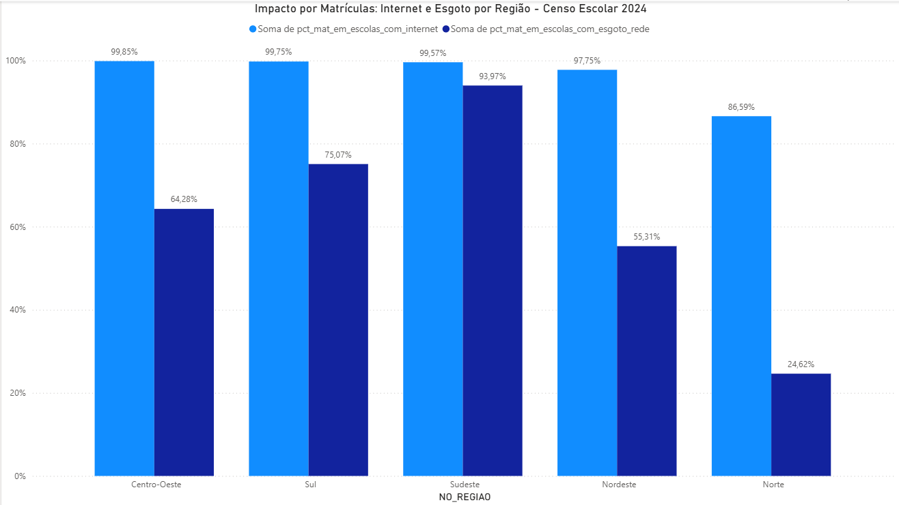
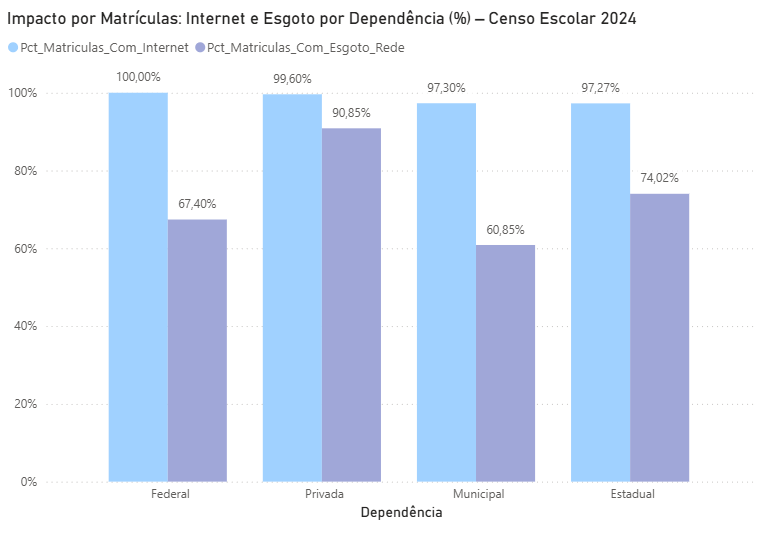
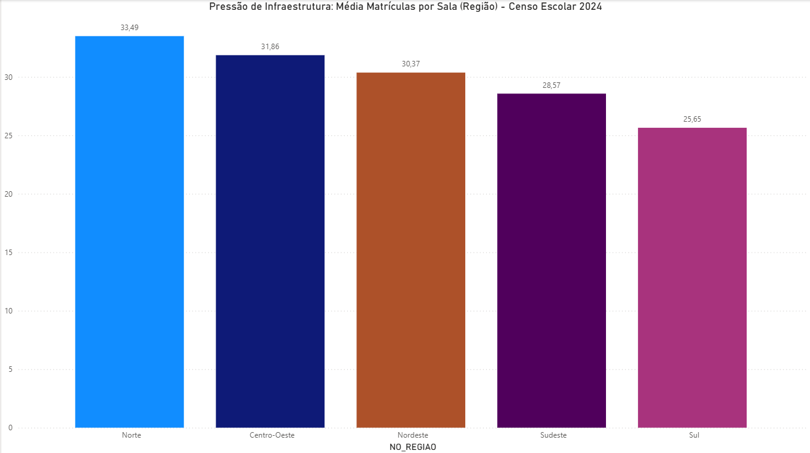
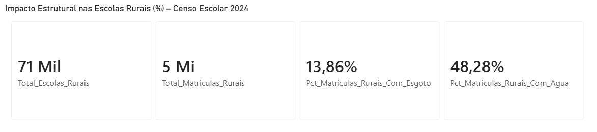

# Análises OLAP

As análises a seguir foram estruturadas em três eixos principais: território (região e localização), dependência administrativa e impacto ponderado por matrícula, permitindo avaliar desigualdades educacionais sob diferentes perspectivas estruturais.

---

## 1) Conectividade por Região (IN_INTERNET)

### Evidência (resultado no DBeaver)

### Interpretação

A análise evidencia desigualdade regional no acesso à internet nas escolas brasileiras, considerando o total de unidades por região.

As regiões Centro-Oeste (**91,51%**) e Sul (**90,65%**) apresentam os maiores percentuais de escolas com acesso à internet, indicando elevado nível de conectividade institucional.

Em contraste, a Região Norte registra apenas **58,85%** de escolas com internet, além de apresentar o maior percentual de escolas sem acesso (**29,26%**), configurando diferença superior a 30 pontos percentuais entre os extremos regionais.

O Nordeste e o Sudeste apresentam níveis intermediários de conectividade, com **73,56%** e **80,18%**, respectivamente, mas também concentram proporção relevante de registros sem informação declarada (**19,45%** no Nordeste e **18,09%** no Sudeste).

A presença de escolas sem dado declarado varia entre as regiões, sendo mais expressiva no Nordeste e Sudeste, o que indica possível fragilidade no preenchimento ou na consolidação das informações.

De forma geral, os resultados confirmam distribuição territorial desigual da infraestrutura tecnológica educacional, com maior consolidação nas regiões mais desenvolvidas e maiores déficits estruturais nas regiões Norte e Nordeste.

> Observação: A métrica foi calculada com base na proporção de escolas com IN_INTERNET = 1 em relação ao total de escolas por região, incluindo no denominador as escolas sem informação declarada.

### Evidência (Power BI) - Consulta 1

O painel confirma os resultados obtidos na consulta SQL, evidenciando maior concentração de conectividade nas regiões Centro-Oeste e Sul, e menor cobertura na Região Norte.

---

## 2) Infraestrutura básica por Região

### Evidência (resultado no DBeaver)

### Interpretação

A análise evidencia desigualdade regional consistente nos indicadores de infraestrutura básica escolar, considerando o total de escolas por região e a presença de registros sem informação declarada.

A Região Norte concentra os menores percentuais de cobertura em todos os serviços analisados, com maior criticidade no acesso à rede pública de esgoto (**11,94%**) e à água por rede pública (**30,91%**), indicando vulnerabilidade estrutural relevante. O Nordeste também apresenta baixa cobertura de esgoto (**32,16%**), reforçando a concentração do déficit sanitário nas regiões Norte e Nordeste.

Em contraste, Sul e Centro-Oeste registram os maiores percentuais de cobertura, sobretudo no fornecimento de energia elétrica (acima de **91%**) e em coleta de lixo (aproximadamente **86%** a **90%**), evidenciando maior consolidação da infraestrutura básica nessas regiões.

Observa-se que a energia elétrica é o serviço mais universalizado entre os indicadores avaliados, enquanto o esgotamento sanitário permanece como o principal gargalo estrutural no país.

Além disso, há variação regional na proporção de registros sem dado informado para cada indicador, com maior impacto no Sudeste e Nordeste, o que sugere cautela na leitura comparativa e possível fragilidade no preenchimento ou consolidação dos microdados.

> Observação: Os percentuais foram calculados sobre o total de escolas por região. Na camada analítica, a view retorna percentuais no padrão 0–1, e a formatação em porcentagem é aplicada no Power BI.

### Evidência Visual (Power BI) - Consulta 2 

O gráfico confirma os percentuais obtidos via SQL e facilita a comparação direta entre os serviços por região, destacando o esgotamento sanitário como principal gargalo.

---

## 3) Infraestrutura por Dependência Administrativa

### Evidência (resultado no DBeaver)

### Interpretação

A análise evidencia desigualdade relevante na infraestrutura escolar conforme a dependência administrativa.

As escolas federais apresentam os maiores percentuais de cobertura em praticamente todos os indicadores, com destaque para energia elétrica (**97,65%**) e acesso à internet (**97,79%**), indicando infraestrutura amplamente consolidada nesse segmento.

As escolas privadas também demonstram desempenho elevado, especialmente no acesso à rede pública de esgoto (**73,31%**), percentual significativamente superior ao observado nas redes estadual (**56,20%**) e municipal (**36,87%**).

As escolas estaduais apresentam desempenho intermediário, enquanto as escolas municipais, que concentram o maior número absoluto de unidades (**128.999**), registram os menores percentuais em todos os indicadores analisados, com destaque para o esgotamento sanitário (**36,87%**) e abastecimento de água por rede pública (**57,67%**).

Observa-se que o esgotamento sanitário constitui o principal gargalo estrutural entre as redes públicas, especialmente na esfera municipal, onde se concentra a maior parcela das escolas do país.

Os resultados indicam que a desigualdade de infraestrutura não se limita a diferenças regionais, mas também se manifesta de forma significativa entre os diferentes níveis de administração escolar.

### Evidência Visual (Power BI) - Consulta 3 

A visualização confirma o contraste estrutural entre as redes federal e privada, com maiores níveis de cobertura, e a rede municipal, que apresenta os menores percentuais, especialmente em esgotamento sanitário. A diferença é mais acentuada no indicador de esgoto, evidenciando vulnerabilidade estrutural concentrada nas escolas municipais.

---

## 4) Conectividade por Dependência Administrativa

### Evidência (resultado no DBeaver)

### Interpretação

A análise evidencia desigualdade digital associada à dependência administrativa das escolas.

As escolas federais apresentam níveis de conectividade amplamente consolidados, com percentuais superiores a **95%** em todos os indicadores analisados, indicando infraestrutura digital praticamente universalizada nesse segmento.

As redes estadual e privada apresentam desempenho intermediário. Embora o acesso básico à internet ultrapasse **80%** nessas redes, observa-se redução relevante quando o indicador passa a ser banda larga e, sobretudo, presença de rede local estruturada.

As escolas municipais registram os menores percentuais em todos os indicadores digitais, especialmente em banda larga (**63,25%**) e rede local (**61,93%**), evidenciando que o principal desafio não se limita ao acesso à internet, mas à qualidade e à estrutura da conectividade disponível.

Os dados indicam que a desigualdade digital manifesta-se de forma mais intensa nos indicadores de infraestrutura interna e qualidade de conexão, reforçando que o simples acesso à internet não garante condições adequadas para uso pedagógico da tecnologia.

### Evidência Visual (Power BI) - Consulta 4

O gráfico confirma os percentuais obtidos via SQL e evidencia que as diferenças entre as redes são mais acentuadas nos indicadores de qualidade da conectividade, banda larga e rede local, do que no acesso básico à internet, destacando maior vulnerabilidade na rede municipal.

--- 

## 5) Conectividade por Localização (Urbana x Rural)

### Evidência (resultado no DBeaver)

### Interpretação

A análise evidencia uma disparidade expressiva entre escolas urbanas e rurais no que se refere à conectividade digital.

Enquanto 88,43% das escolas urbanas possuem acesso à internet, esse percentual cai para 54,91% nas escolas rurais, configurando diferença superior a 30 pontos percentuais.

A desigualdade torna-se ainda mais acentuada quando observados os indicadores de qualidade da conectividade: apenas 41,51% das escolas rurais possuem banda larga, contra 80,08% nas áreas urbanas. O mesmo padrão é observado na presença de rede local estruturada (78,46% urbano vs. 41,15% rural).

Os resultados indicam que a desigualdade digital no contexto educacional brasileiro está fortemente associada ao território, com maior vulnerabilidade nas áreas rurais, especialmente em relação à qualidade e estrutura da infraestrutura tecnológica disponível.

### Evidência Visual (Power BI) - Consulta 5

A visualização confirma a diferença significativa entre escolas urbanas e rurais, especialmente nos indicadores de banda larga e rede local, evidenciando maior vulnerabilidade estrutural nas áreas rurais.

---

## 6) Infraestrutura Básica por Localização (Urbana x Rural)

### Evidência (resultado no DBeaver)

### Interpretação

A análise evidencia disparidade estrutural acentuada entre escolas urbanas e rurais nos indicadores de infraestrutura básica.

Enquanto as escolas urbanas apresentam cobertura superior a 84% em abastecimento de água e quase 90% em energia elétrica e coleta de lixo, as escolas rurais registram percentuais significativamente inferiores, especialmente em esgotamento sanitário, onde apenas 6,56% possuem rede pública.

A diferença superior a 60 pontos percentuais no acesso à rede pública de esgoto indica um déficit sanitário crítico nas áreas rurais.

A magnitude das diferenças evidencia que as condições materiais mínimas de funcionamento escolar apresentam forte variação territorial, especialmente nas áreas rurais, onde os serviços sanitários configuram o principal ponto de fragilidade estrutural.

### Evidência Visual (Power BI) - Consulta 6 

O gráfico confirma a diferença estrutural entre escolas urbanas e rurais, com maior déficit no esgotamento sanitário e demais serviços básicos nas áreas rurais.

---

## 7) Impacto por Matrículas (Região)

### Evidência (resultado no DBeaver)

### Interpretação

Ao considerar o peso das matrículas, observa-se que a proporção de alunos matriculados em escolas com acesso à internet é elevada na maior parte das regiões, superando 97% no Centro-Oeste, Sul, Sudeste e Nordeste. Mesmo no Norte, o percentual atinge 86,59%, valor superior ao observado quando a métrica considera apenas o número de escolas.

Esse resultado indica que as matrículas encontram-se concentradas em escolas com acesso à internet, reduzindo parcialmente o impacto da desigualdade quando a análise é ponderada pelo volume de alunos.

Entretanto, o cenário é distinto no indicador de esgotamento sanitário. A Região Norte apresenta apenas 24,62% das matrículas em escolas com acesso à rede pública de esgoto, enquanto o Sudeste atinge 93,97%. A diferença expressiva demonstra que, sob a perspectiva do estudante, a desigualdade estrutural permanece significativa, especialmente nas regiões com menor cobertura sanitária.

A análise ponderada por matrículas permite avaliar não apenas a distribuição de infraestrutura entre escolas, mas também o potencial impacto dessas condições sobre o conjunto de alunos atendidos.

### Evidência Visual (Power BI) - Consulta 7 

A visualização confirma a análise ponderada por matrículas, mostrando que a conectividade tende a concentrar alunos em escolas com melhor estrutura, enquanto o déficit de esgotamento sanitário permanece mais crítico em determinadas regiões.

---

## 8) Impacto por Matrículas (Dependência Administrativa)

### Evidência (resultado no DBeaver)

### Interpretação

Ao considerar o volume de matrículas, observa-se que o acesso à internet atinge níveis elevados em todas as dependências administrativas, superando 97% nas redes estadual e municipal e alcançando praticamente universalização nas redes federal e privada.

Esse resultado indica que, sob a perspectiva do aluno, apresenta elevada cobertura sob a perspectiva das matrículas, mesmo nas redes com menor infraestrutura média quando analisadas por número de escolas.

Entretanto, a análise do esgotamento sanitário revela disparidades mais relevantes. A rede municipal apresenta 60,85% das matrículas em escolas com acesso à rede pública de esgoto, percentual inferior ao observado nas redes estadual (74,02%) e privada (90,85%).

Os dados sugerem que, embora a conectividade digital esteja relativamente distribuída entre as redes, os déficits estruturais de saneamento permanecem concentrados principalmente na rede municipal, que atende o maior contingente de alunos.

### Evidência Visual (Power BI) - Consulta 8 

A análise ponderada por matrículas indica que a conectividade atinge percentuais elevados entre redes, mas os déficits de esgotamento sanitário permanecem mais concentrados, especialmente na rede municipal, que atende o maior contingente de alunos.

---

## 9) Pressão de Infraestrutura: Matrículas por Sala (Região)

### Evidência (resultado no DBeaver)

### Interpretação

A análise da razão entre matrículas e salas utilizadas indica diferenças na pressão estrutural das unidades escolares entre as regiões.

A Região Norte apresenta a maior média, com 33,49 matrículas por sala, enquanto a Região Sul registra o menor valor, com 25,65.

A diferença observada sugere maior concentração de alunos por espaço físico nas regiões com menor infraestrutura consolidada, pode indicar maior pressão sobre a infraestrutura física das unidades escolares e a qualidade do ambiente escolar.

Os dados indicam que a desigualdade educacional não se manifesta apenas na disponibilidade de serviços e conectividade, mas também na capacidade física das unidades escolares.

### Evidência Visual (Power BI) - Consulta 9 

A razão entre matrículas e salas utilizadas evidencia diferenças na pressão estrutural entre regiões, indicando maior concentração de alunos por sala em regiões com menor infraestrutura consolidada.

---

## 10) Impacto Estrutural nas Escolas Rurais

### Evidência (resultado no DBeaver)

### Interpretação

A análise específica das escolas rurais evidencia um cenário de vulnerabilidade estrutural significativa.

Embora o universo analisado compreenda mais de cinco milhões de matrículas em áreas rurais, apenas 13,86% dos alunos estão matriculados em escolas com acesso à rede pública de esgoto. No caso do abastecimento de água via rede pública, o percentual atinge 48,28%.

Os dados indicam que a maioria dos estudantes da zona rural está inserida em unidades escolares sem cobertura adequada de serviços sanitários básicos, revelando um déficit estrutural que ultrapassa a dimensão tecnológica e alcança condições essenciais de salubridade e funcionamento escolar.

### Evidência Visual (Power BI) - Consulta 10

A visualização consolida o recorte rural (TP_LOCALIZACAO = 2), evidenciando o baixo percentual de matrículas em escolas com rede pública de esgoto e a cobertura parcial de abastecimento de água.

---

## 11) Percentual de Escolas sem Rede Pública de Esgoto (Região)

### Evidência (resultado no DBeaver)

### Interpretação

A análise evidencia disparidade expressiva na cobertura de esgotamento sanitário entre as regiões brasileiras.

Na Região Norte, **86,45%** das escolas não possuem acesso à rede pública de esgoto, percentual significativamente superior ao observado no Sudeste, onde apenas **10,65%** das unidades encontram-se nessa condição.

O contraste regional demonstra forte concentração do déficit sanitário nas regiões Norte e Nordeste, reforçando a persistência de desigualdades estruturais na infraestrutura escolar brasileira.

A leitura do indicador sob a perspectiva da ausência do serviço torna ainda mais evidente a magnitude da carência sanitária em determinadas regiões do país.

> Observação: Os percentuais foram calculados considerando apenas escolas com informação válida (0 ou 1) para o indicador.

