# Análises OLAP

As análises a seguir foram estruturadas em três eixos principais: território (região e localização), dependência administrativa e impacto ponderado por matrícula, permitindo avaliar desigualdades educacionais sob diferentes perspectivas estruturais.

---

## 1) Conectividade por Região (IN_INTERNET)

### Evidência (resultado no DBeaver)
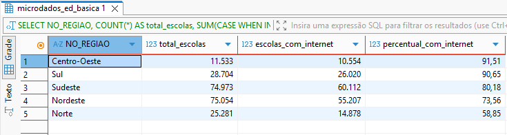

### Interpretação

A análise evidencia disparidade regional no acesso à internet nas escolas brasileiras.

As regiões Centro-Oeste e Sul apresentam percentuais superiores a 90% de conectividade, enquanto a Região Norte apresenta aproximadamente 58,85%, configurando diferença superior a 30 pontos percentuais entre os extremos.

Essa diferença sugere desigualdade estrutural na infraestrutura tecnológica educacional, possivelmente associada a fatores geográficos, econômicos e de investimento público.

O padrão observado confirma que a conectividade escolar apresenta distribuição territorial assimétrica, com maior consolidação nas regiões mais desenvolvidas.

> Observação: A métrica foi calculada com base na proporção de escolas com IN_INTERNET = 1 em relação ao total de escolas por região.

### Evidência (Power BI) - Consulta 1

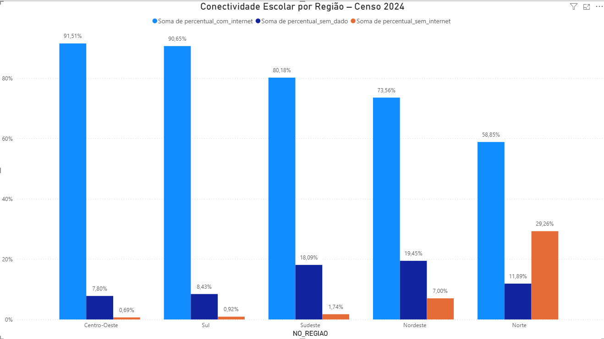

O painel confirma os resultados obtidos na consulta SQL, evidenciando maior concentração de conectividade nas regiões Centro-Oeste e Sul, e menor cobertura na Região Norte.

---

## 2) Infraestrutura básica por Região

### Evidência (resultado no DBeaver)
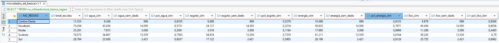

### Interpretação

A análise evidencia desigualdade regional consistente nos indicadores de infraestrutura básica escolar.

A Região Norte apresenta os menores percentuais em todos os serviços analisados, com destaque para o acesso à rede pública de esgoto (11,94%) e água (30,91%), indicando forte vulnerabilidade estrutural.

A Região Nordeste também apresenta baixa cobertura de esgoto (32,16%), reforçando a concentração do déficit sanitário nas regiões Norte e Nordeste.

Em contraste, Sul e Centro-Oeste registram os maiores percentuais de cobertura, especialmente no fornecimento de energia elétrica (acima de 91%), evidenciando maior consolidação da infraestrutura básica nessas regiões.

Observa-se que a energia elétrica é o serviço mais universalizado nacionalmente, enquanto o esgotamento sanitário configura o principal gargalo estrutural.

Os dados indicam que as diferenças regionais observadas abrangem não apenas aspectos tecnológicos, mas também serviços básicos essenciais à estrutura física das escolas.

### Evidência Visual (Power BI) - Consulta 2 

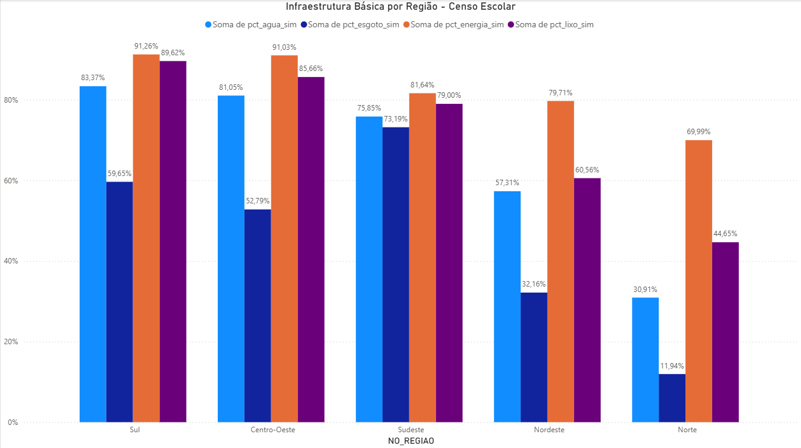

O gráfico confirma os percentuais obtidos via SQL e facilita a comparação direta entre os serviços por região, destacando o esgotamento sanitário como principal gargalo.

---

## 3) Infraestrutura por Dependência Administrativa

### Evidência (resultado no DBeaver)
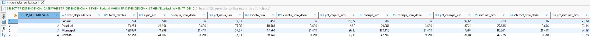

### Interpretação

A análise revela desigualdade significativa de infraestrutura conforme a dependência administrativa.

As escolas federais apresentam os maiores percentuais de cobertura em praticamente todos os indicadores, com destaque para energia elétrica (97,65%) e acesso à internet (97,79%), indicando infraestrutura amplamente consolidada.

As escolas privadas também apresentam desempenho elevado e consistente, especialmente no acesso à rede pública de esgoto (73,31%), superior às redes estadual e municipal.

As escolas estaduais apresentam desempenho intermediário, enquanto as escolas municipais, que concentram o maior número absoluto de unidades (128.999), registram os menores percentuais em todos os indicadores analisados, especialmente em esgotamento sanitário (36,87%) e abastecimento de água (57,67%).

Observa-se que o esgotamento sanitário permanece como o principal gargalo estrutural em todas as dependências administrativas.

### Evidência Visual (Power BI) - Consulta 3 

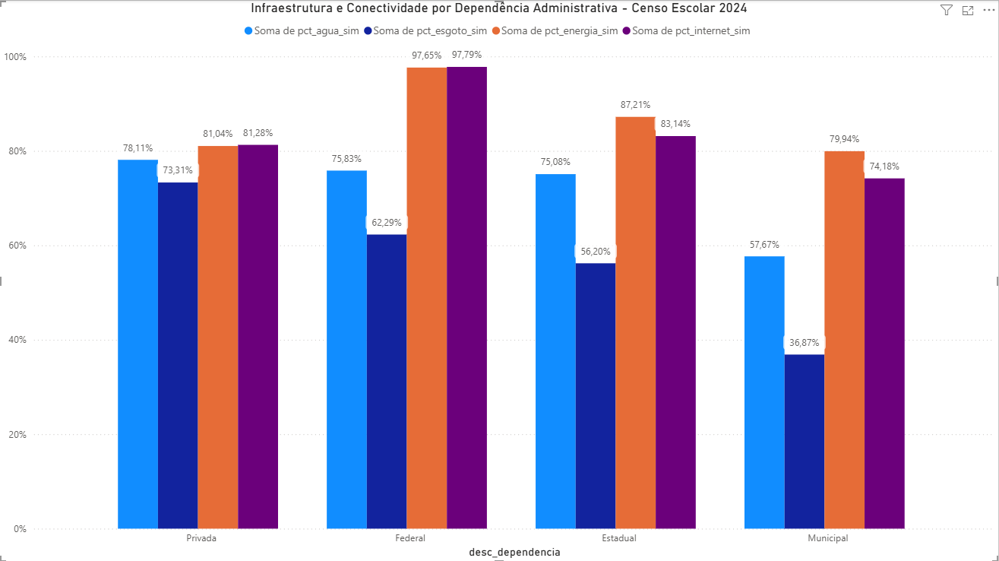

A visualização confirma as diferenças por dependência administrativa e reforça o contraste entre redes federal/privada e municipal, sobretudo em esgotamento sanitário.

---

## 4) Conectividade por Dependência Administrativa

### Evidência (resultado no DBeaver)
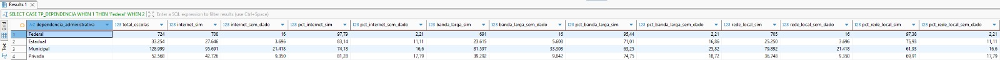

### Interpretação

A análise destaca que a desigualdade digital nas escolas brasileiras apresenta forte relação com a dependência administrativa.

Embora o acesso básico à internet esteja relativamente disseminado nas redes estadual, municipal e privada, observa-se diferença mais acentuada quando o indicador é banda larga e presença de rede local estruturada.

As escolas municipais apresentam os menores percentuais tanto de banda larga (63,25%) quanto de rede local (61,93%), indicando que o desafio não está apenas no acesso à internet, mas na qualidade e estrutura da conectividade disponível.

As escolas federais demonstram padrão de conectividade praticamente universalizado, com percentuais superiores a 95% em todos os indicadores digitais.

Os resultados sugerem que a desigualdade digital envolve não apenas presença de conexão, mas também qualidade da infraestrutura tecnológica interna, o que pode impactar diretamente o uso pedagógico da tecnologia.

### Evidência Visual (Power BI) - Consulta 4

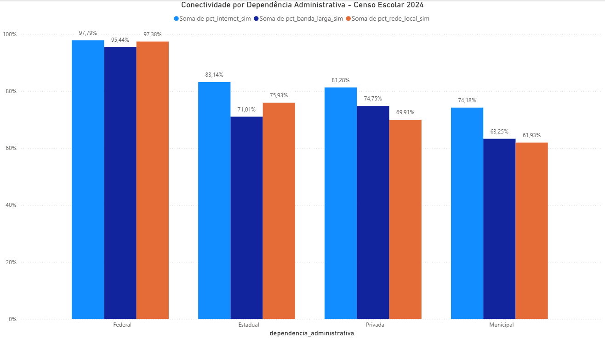

O gráfico confirma os percentuais obtidos via SQL e evidencia diferenças mais acentuadas na qualidade da conectividade (banda larga e rede local) do que no simples acesso à internet.

--- 

## 5) Conectividade por Localização (Urbana x Rural)

### Evidência (resultado no DBeaver)
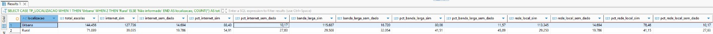

### Interpretação

A análise evidencia uma disparidade expressiva entre escolas urbanas e rurais no que se refere à conectividade digital.

Enquanto 88,43% das escolas urbanas possuem acesso à internet, esse percentual cai para 54,91% nas escolas rurais, configurando diferença superior a 30 pontos percentuais.

A desigualdade torna-se ainda mais acentuada quando observados os indicadores de qualidade da conectividade: apenas 41,51% das escolas rurais possuem banda larga, contra 80,08% nas áreas urbanas. O mesmo padrão é observado na presença de rede local estruturada (78,46% urbano vs. 41,15% rural).

Os resultados indicam que a desigualdade digital no contexto educacional brasileiro está fortemente associada ao território, com maior vulnerabilidade nas áreas rurais, especialmente em relação à qualidade e estrutura da infraestrutura tecnológica disponível.

### Evidência Visual (Power BI) - Consulta 5

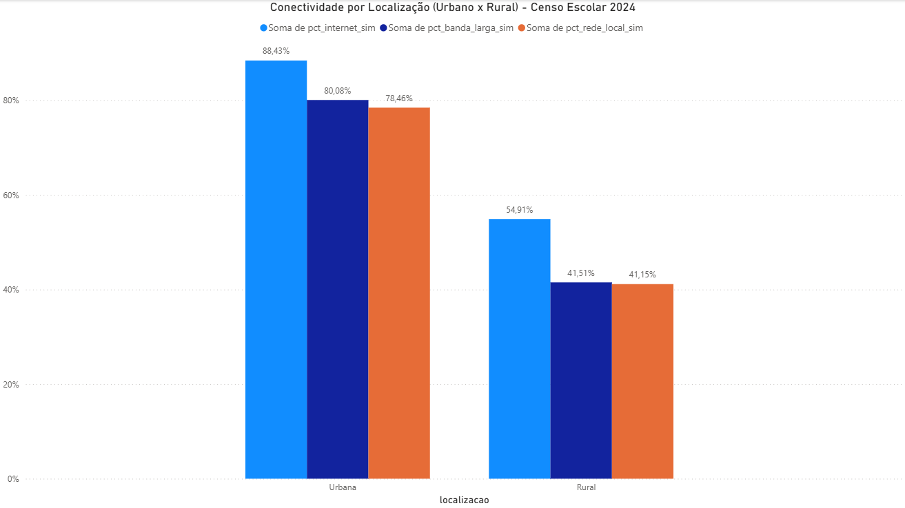

A visualização confirma a diferença significativa entre escolas urbanas e rurais, especialmente nos indicadores de banda larga e rede local, evidenciando maior vulnerabilidade estrutural nas áreas rurais.

---

## 6) Infraestrutura Básica por Localização (Urbana x Rural)

### Evidência (resultado no DBeaver)
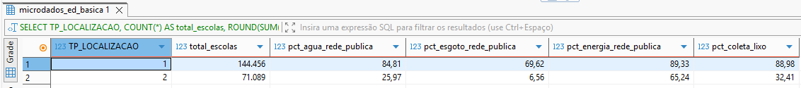

### Interpretação

A análise evidencia disparidade estrutural acentuada entre escolas urbanas e rurais nos indicadores de infraestrutura básica.

Enquanto as escolas urbanas apresentam cobertura superior a 84% em abastecimento de água e quase 90% em energia elétrica e coleta de lixo, as escolas rurais registram percentuais significativamente inferiores, especialmente em esgotamento sanitário, onde apenas 6,56% possuem rede pública.

A diferença superior a 60 pontos percentuais no acesso à rede pública de esgoto indica um déficit sanitário crítico nas áreas rurais.

A magnitude das diferenças evidencia que as condições materiais mínimas de funcionamento escolar apresentam forte variação territorial, especialmente nas áreas rurais, onde os serviços sanitários configuram o principal ponto de fragilidade estrutural.

### Evidência Visual (Power BI)

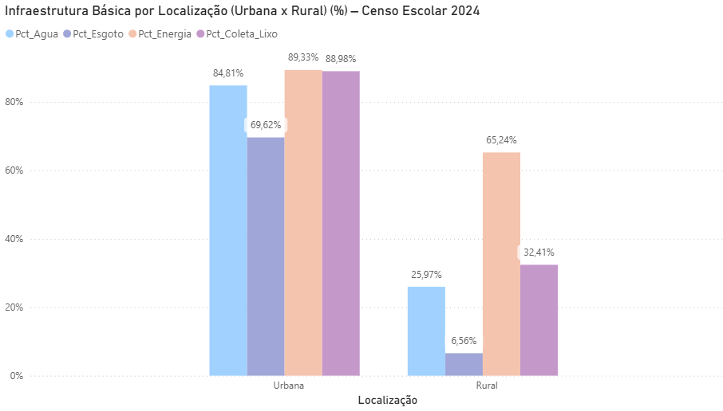

O gráfico confirma a diferença estrutural entre escolas urbanas e rurais, com maior déficit no esgotamento sanitário e demais serviços básicos nas áreas rurais.

---

## 7) Impacto por Matrículas (Região)

### Evidência (resultado no DBeaver)
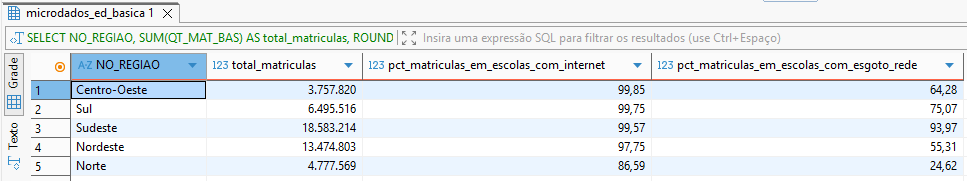

### Interpretação

Ao considerar o peso das matrículas, observa-se que a proporção de alunos matriculados em escolas com acesso à internet é elevada na maior parte das regiões, superando 97% no Centro-Oeste, Sul, Sudeste e Nordeste. Mesmo no Norte, o percentual atinge 86,59%, valor superior ao observado quando a métrica considera apenas o número de escolas.

Esse resultado indica que as matrículas encontram-se concentradas em escolas com acesso à internet, reduzindo parcialmente o impacto da desigualdade quando a análise é ponderada pelo volume de alunos.

Entretanto, o cenário é distinto no indicador de esgotamento sanitário. A Região Norte apresenta apenas 24,62% das matrículas em escolas com acesso à rede pública de esgoto, enquanto o Sudeste atinge 93,97%. A diferença expressiva demonstra que, sob a perspectiva do estudante, a desigualdade estrutural permanece significativa, especialmente nas regiões com menor cobertura sanitária.

A análise ponderada por matrículas permite avaliar não apenas a distribuição de infraestrutura entre escolas, mas também o potencial impacto dessas condições sobre o conjunto de alunos atendidos.

## 8) Impacto por Matrículas (Dependência Administrativa)

### Evidência (resultado no DBeaver)
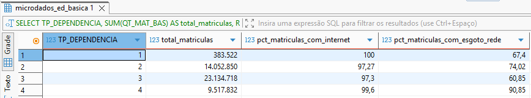

### Interpretação

Ao considerar o volume de matrículas, observa-se que o acesso à internet atinge níveis elevados em todas as dependências administrativas, superando 97% nas redes estadual e municipal e alcançando praticamente universalização nas redes federal e privada.

Esse resultado indica que, sob a perspectiva do aluno, apresenta elevada cobertura sob a perspectiva das matrículas, mesmo nas redes com menor infraestrutura média quando analisadas por número de escolas.

Entretanto, a análise do esgotamento sanitário revela disparidades mais relevantes. A rede municipal apresenta 60,85% das matrículas em escolas com acesso à rede pública de esgoto, percentual inferior ao observado nas redes estadual (74,02%) e privada (90,85%).

Os dados sugerem que, embora a conectividade digital esteja relativamente distribuída entre as redes, os déficits estruturais de saneamento permanecem concentrados principalmente na rede municipal, que atende o maior contingente de alunos.

## 9) Pressão de Infraestrutura: Matrículas por Sala (Região)

### Evidência (resultado no DBeaver)
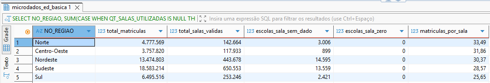

### Interpretação

A análise da razão entre matrículas e salas utilizadas indica diferenças na pressão estrutural das unidades escolares entre as regiões.

A Região Norte apresenta a maior média, com 33,49 matrículas por sala, enquanto a Região Sul registra o menor valor, com 25,65.

A diferença observada sugere maior concentração de alunos por espaço físico nas regiões com menor infraestrutura consolidada, pode indicar maior pressão sobre a infraestrutura física das unidades escolares e a qualidade do ambiente escolar.

Os dados indicam que a desigualdade educacional não se manifesta apenas na disponibilidade de serviços e conectividade, mas também na capacidade física das unidades escolares.

## 10) Impacto Estrutural nas Escolas Rurais

### Evidência (resultado no DBeaver)

### Interpretação

A análise específica das escolas rurais evidencia um cenário de vulnerabilidade estrutural significativa.

Embora o universo analisado compreenda mais de cinco milhões de matrículas em áreas rurais, apenas 13,86% dos alunos estão matriculados em escolas com acesso à rede pública de esgoto. No caso do abastecimento de água via rede pública, o percentual atinge 48,28%.

Os dados indicam que a maioria dos estudantes da zona rural está inserida em unidades escolares sem cobertura adequada de serviços sanitários básicos, revelando um déficit estrutural que ultrapassa a dimensão tecnológica e alcança condições essenciais de salubridade e funcionamento escolar.

## 11) Percentual de Escolas sem Rede Pública de Esgoto (Região)

### Evidência (resultado no DBeaver)
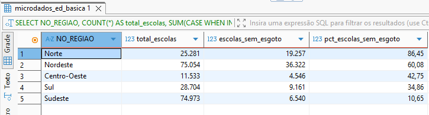

### Interpretação

A análise evidencia disparidade expressiva na cobertura de esgotamento sanitário entre as regiões brasileiras.

Na Região Norte, 76,17% das escolas não possuem acesso à rede pública de esgoto, percentual significativamente superior ao observado no Sudeste, onde apenas 8,72% das unidades encontram-se nessa condição.

O contraste regional demonstra concentração do déficit sanitário nas regiões Norte e Nordeste, reforçando a existência de assimetria estrutural na infraestrutura escolar.

A leitura do indicador sob a perspectiva da ausência do serviço torna mais evidente a magnitude do problema sanitário em determinadas regiões do país.
